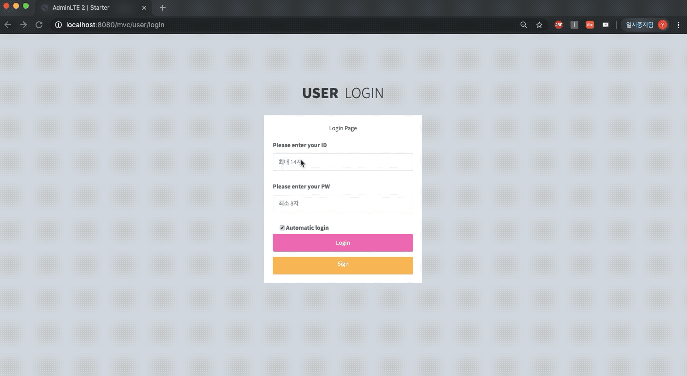
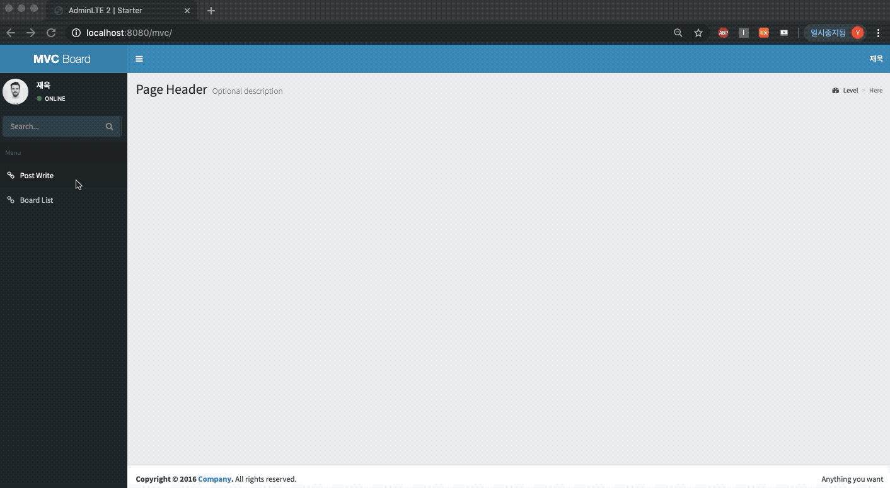

# Spring-CRUD

# 開発環境
JDK 1.8 
Apache Tomcat 9.0 
Mysql 8.0.16 
Bootstrap 3 
Spring Framework 

## Main Page
 

## Sign 
 

会員加入の空いているところや重複があればメッセージ出力 
JsファイルにでID,PW,名前検証及び有効性検査 
IDは4~14文字PWは8文字以上に特殊文字を含む名前はハングルで6文字まで 
IDは重複する非同期処理 
PWはBcrypt方式で暗号化 

## UserDB
 

会員加入の重複のためにあらかじめ生成しておいたアカウントとパスワードの暗号化の確認 

## Login
 

IDとPWの検証と有効性検査をしながらajaxを利用して間違えたと出力 

## Write
 

文作成  
作成後3日以内の文章にはNewマーク付いています 

## Post Check
 

掲示物の修正や削除が可能 

## BoardDB
 

掲示板DBの確認 

## Post Search
 

掲示板一ページに掲示物数10、20、30個に調整可能 
以前の次のボタン活性化 
掲示物数によるページ数補正 
検索時検索単語を維持しつつ単語を含むすべての掲示物を検索 

## Interceptor
 

会員でない人は文章を書くことができません 
加入ページに移動 
インターセプターを利用したログイン 
インタセプターを利用する理由は,削除,修正などすべての要請時にセッション情報を確認しなければならないので,繰り返しコードを無くすために 

